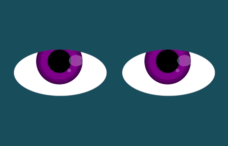

# Eye-Exercise

**Based on code provided for the MIT xPro Web Development with JavaScript course.**

Original Repository: [John Williams eyes](https://github.com/johntango/eyes)

## Description

The html file features two large eyes which follow the mouse position. Clicking anywhere within the body will pause the animation or restart it. 

## How to Run

Clone the Repository or download to your local machine. Open the index.html file in your browser. 

* Click anywhere on the screen to stop/start the animation

## Roadmap of Future Improvements

* Add iris changes 
    - change width to account for curvature and rotation 
* Add pupil dialation
    - change to account for distance from mouse position (focus on item)
* Add additional features to add additional realism and interaction
    - add emote function animation sequences

## License info

[MIT License](LICENSE)

